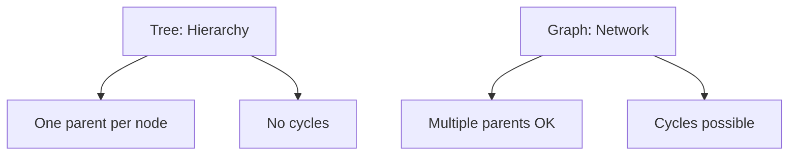
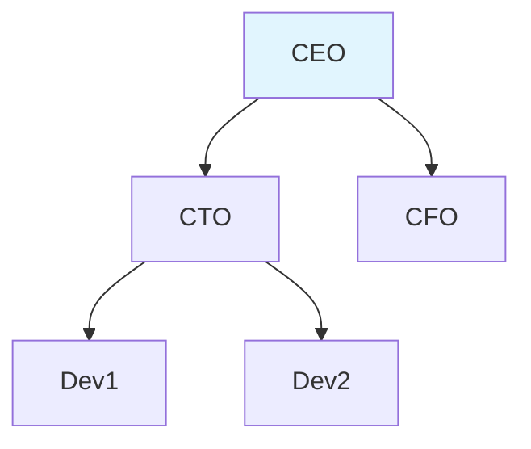
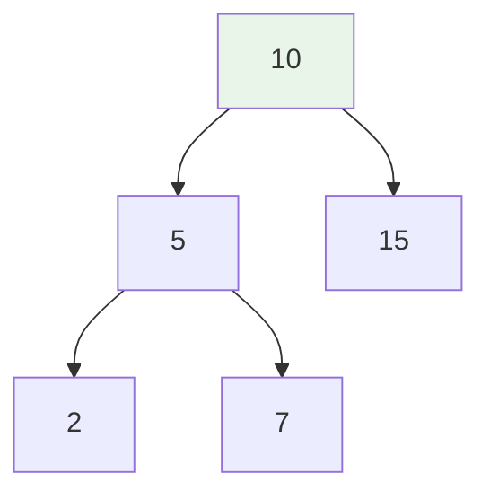
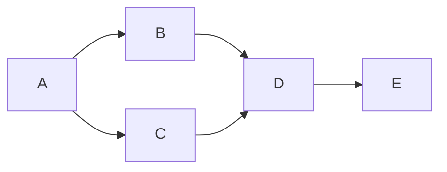
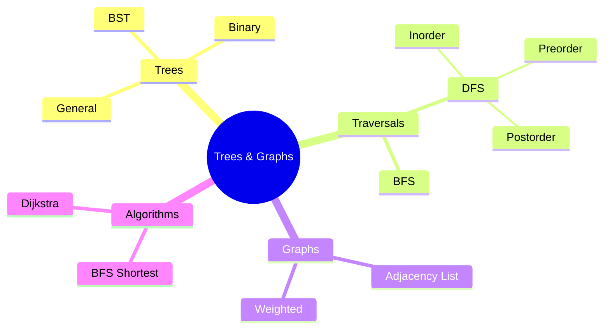

# Trees and Graphs in Python: Comprehensive Guide

Trees represent hierarchies (folders, org charts). Graphs represent networks (social media, maps). This guide builds from basics to advanced implementations.

## Table of Contents
- [1. Core Concepts](#1-core-concepts)
- [2. Trees](#2-trees)
- [3. Binary Trees & Traversals](#3-binary-trees--traversals)
- [4. Binary Search Trees (BST)](#4-binary-search-trees-bst)
- [5. Graphs](#5-graphs)
- [6. Graph Algorithms](#6-graph-algorithms)
- [7. Use Cases](#7-use-cases)
- [8. Practice by Level](#8-practice-by-level)

---

## 1. Core Concepts

| Term | Trees | Graphs |
|------|-------|--------|
| **Node** | Holds data + children | Holds data + neighbors |
| **Edge** | Parent → Child | Node ↔ Node (any direction) |
| **Root** | Single top node | Optional start point |
| **Cycle** | ❌ Never | ✅ Possible |



**Real world:**
```
Tree: /home/user/docs/file.txt
Graph: Facebook friends network
```

***

## 2. Trees

### 2.1 General Tree (Any # children)

```python
class TreeNode:
    def __init__(self, value):
        self.value = value
        self.children = []

    def add_child(self, child_node):
        self.children.append(child_node)

# Company org chart
ceo = TreeNode("CEO")
cto = TreeNode("CTO")
cfo = TreeNode("CFO")
dev1 = TreeNode("Dev 1")
dev2 = TreeNode("Dev 2")

ceo.add_child(cto)
ceo.add_child(cfo)
cto.add_child(dev1)
cto.add_child(dev2)
```



### 2.2 Pretty Print Tree

```python
def print_tree(node, level=0):
    indent = "  " * level
    print(f"{indent}- {node.value}")
    for child in node.children:
        print_tree(child, level + 1)

print_tree(ceo)
```
```
- CEO
  - CTO
    - Dev 1
    - Dev 2
  - CFO
```

***

## 3. Binary Trees & Traversals

Each node has **exactly 2 children max**: `left`, `right`.

### 3.1 Binary Tree Structure

```python
class BinaryTreeNode:
    def __init__(self, value):
        self.value = value
        self.left = None
        self.right = None

root = BinaryTreeNode(10)
root.left = BinaryTreeNode(5)
root.right = BinaryTreeNode(15)
root.left.left = BinaryTreeNode(2)
root.left.right = BinaryTreeNode(7)
```



### 3.2 Three DFS Traversals

| Traversal | Order | Use Case |
|-----------|-------|----------|
| **Inorder** | L-Root-R | Sorted output (BSTs) |
| **Preorder** | Root-L-R | Copy tree, serialize |
| **Postorder** | L-R-Root | Delete tree, compute |

```python
def inorder(node):
    if node:
        inorder(node.left)
        print(node.value, end=" ")  # 2 5 7 10 15
        inorder(node.right)

def preorder(node):
    if node:
        print(node.value, end=" ")  # 10 5 2 7 15
        preorder(node.left)
        preorder(node.right)
```

### 3.3 BFS (Level Order)

```python
from collections import deque

def level_order(root):
    if not root: return
    q = deque([root])
    while q:
        node = q.popleft()
        print(node.value, end=" ")  # 10 5 15 2 7
        if node.left: q.append(node.left)
        if node.right: q.append(node.right)
```


***

## 4. Binary Search Trees (BST)

**Rule**: Left < Root < Right → Fast search/insert!

### 4.1 BST Insert

```python
class BSTNode:
    def __init__(self, value):
        self.value = value
        self.left = self.right = None

    def insert(self, value):
        if value < self.value:
            if self.left is None:
                self.left = BSTNode(value)
            else:
                self.left.insert(value)
        elif value > self.value:
            if self.right is None:
                self.right = BSTNode(value)
            else:
                self.right.insert(value)

root = BSTNode(10)
for v in [5,15,2,7,12,20]: root.insert(v)
```

### 4.2 BST Search

```python
def search(node, target):
    if not node: return False
    if target == node.value: return True
    return search(node.left, target) if target < node.value else search(node.right, target)
```

**Inorder traversal = sorted list!**

***

## 5. Graphs

### 5.1 Adjacency List (Most Common)

```python
graph = {
    'A': ['B', 'C'],
    'B': ['A', 'D'], 
    'C': ['A', 'D'],
    'D': ['B', 'C', 'E'],
    'E': ['D']
}
```



**Weighted Graph:**
```python
weighted = {
    'A': [('B', 5), ('C', 1)],
    'B': [('A', 5), ('C', 2), ('D', 1)]
}
```

***

## 6. Graph Algorithms

### 6.1 BFS: Shortest Path (Unweighted)

```python
def shortest_path(graph, start, goal):
    from collections import deque
    q = deque([start])
    visited = {start}
    parent = {start: None}
    
    while q:
        node = q.popleft()
        if node == goal: break
        for nei in graph[node]:
            if nei not in visited:
                visited.add(nei)
                parent[nei] = node
                q.append(nei)
    
    # Reconstruct path
    if goal not in parent: return None
    path = []
    cur = goal
    while cur:
        path.append(cur)
        cur = parent[cur]
    return path[::-1]

print(shortest_path(graph, 'A', 'E'))  # ['A', 'B', 'D', 'E']
```

### 6.2 DFS (Recursive)

```python
def dfs(graph, node, visited=None):
    if visited is None: visited = set()
    visited.add(node)
    print(node, end=" ")
    for nei in graph[node]:
        if nei not in visited:
            dfs(graph, nei, visited)
```

### 6.3 Dijkstra (Weighted, Advanced)

```python
import heapq

def dijkstra(graph, start):
    dist = {node: float('inf') for node in graph}
    dist[start] = 0
    pq = [(0, start)]
    
    while pq:
        d, node = heapq.heappop(pq)
        if d > dist[node]: continue
        
        for nei, weight in graph[node]:
            new_d = d + weight
            if new_d < dist[nei]:
                dist[nei] = new_d
                heapq.heappush(pq, (new_d, nei))
    return dist
```

***

## 7. Use Cases

| Domain | Tree | Graph |
|--------|------|-------|
| **File System** | Folders | ❌ |
| **Org Chart** | Managers | ❌ |
| **Social Network** | ❌ | Friends |
| **Maps** | ❌ | Roads + Distance |
| **Web Pages** | ❌ | Links |
| **Expression** | Math ops | ❌ |

---

## 8. Practice by Level

### 🟢 Beginner
```
1. Build family tree → print indented
2. Binary tree: count nodes, find max
3. Print all leaf nodes
```

### 🟡 Intermediate
```
1. BST: implement insert + search
2. Graph from file → adjacency list
3. BFS: check if cities connected
```

### 🔴 Advanced
```
1. Dijkstra on road distances
2. Cycle detection (DFS + recursion stack)
3. Topological sort (task dependencies)
```

***

## Quick Reference


