# Part 1

## 1. Core concepts: Tree vs. Graph

**Explanation**
*   **Graph:** A structure consisting of a set of vertices $V$ and edges $E$. It models pairwise relationships. It can contain cycles and may or may not be connected.
*   **Tree:** A specific type of graph that is **connected**, **undirected**, and **acyclic**.
    *   Property: $|E| = |V| - 1$.
    *   Property: There is exactly one unique simple path between any two nodes.

**Mermaid Diagram**
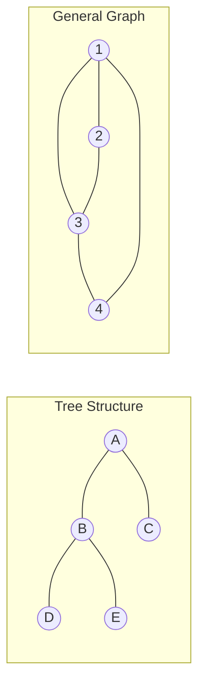

**Python Implementation**
```python
# 1. Adjacency List Representation
general_graph = {
    "1": ["2", "3", "4"],
    "2": ["1", "3"],
    "3": ["1", "2", "4"],
    "4": ["3", "1"]
}

tree_graph = {
    "A": ["B", "C"],
    "B": ["A", "D", "E"],
    "C": ["A"],
    "D": ["B"],
    "E": ["B"]
}

# 2. Check if valid tree (Connected + |E| == |V| - 1)
def is_tree(adj):
    if not adj: return True
    num_vertices = len(adj)
    # Count edges (undirected edges appear twice in adj list)
    num_edges = sum(len(neighbors) for neighbors in adj.values()) // 2
    
    # Condition 1: Edge count
    if num_edges != num_vertices - 1:
        return False
        
    # Condition 2: Connectivity (BFS)
    start_node = next(iter(adj))
    visited = set([start_node])
    queue = [start_node]
    
    while queue:
        u = queue.pop(0)
        for v in adj[u]:
            if v not in visited:
                visited.add(v)
                queue.append(v)
                
    return len(visited) == num_vertices

print(f"Is Tree: {is_tree(tree_graph)}")   # True
print(f"Is Tree: {is_tree(general_graph)}") # False
```

---

## 2. Directed vs. Undirected

**Explanation**
*   **Undirected:** Edges are unordered pairs $\{u, v\}$. The relationship is symmetric (e.g., Facebook friends).
*   **Directed (Digraph):** Edges are ordered pairs $(u, v)$. The relationship is one-way (e.g., Twitter/X follows, URL links).
*   **Arborescence (Directed Tree):** A digraph with a root node $r$ where there is exactly one unique path from $r$ to every other node.

**Mermaid Diagram**
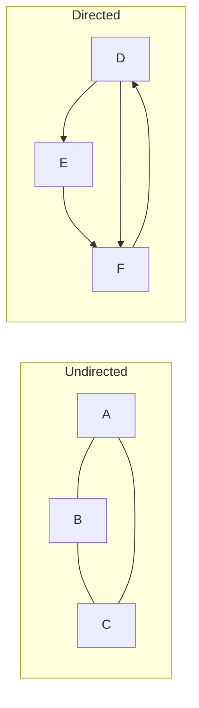

**Python Implementation**
```python
# Directed Graph Adjacency List
digraph = {
    "A": ["B", "C"], # A points to B and C
    "B": ["D"],
    "C": [],
    "D": ["A"]       # Cycle D -> A
}

def get_indegrees(adj):
    indegrees = {u: 0 for u in adj}
    for u in adj:
        for v in adj[u]:
            indegrees[v] += 1
    return indegrees

print(get_indegrees(digraph)) # {'A': 1, 'B': 1, 'C': 1, 'D': 1}
```

---

## 3. Rooted Trees & Parent-Child

**Explanation**
*   **Root:** The single top-level node (Depth 0).
*   **Parent/Child:** If $u \to v$, $u$ is the parent, $v$ is the child.
*   **Leaf:** A node with no children.

**Mermaid Diagram**
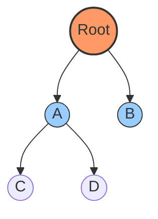

**Python Implementation**
```python
class TreeNode:
    def __init__(self, val):
        self.val = val
        self.children = []
        self.parent = None

    def add_child(self, child_node):
        child_node.parent = self
        self.children.append(child_node)

    def get_level(self):
        level = 0
        p = self.parent
        while p:
            level += 1
            p = p.parent
        return level

root = TreeNode("Root")
child_a = TreeNode("A")
root.add_child(child_a)

print(f"Node: {child_a.val}, Level: {child_a.get_level()}") # Level 1
```

---

## 4. Forests

**Explanation**
*   A **Forest** is a disjoint union of trees.
*   It is an acyclic graph that is not necessarily connected.

**Mermaid Diagram**
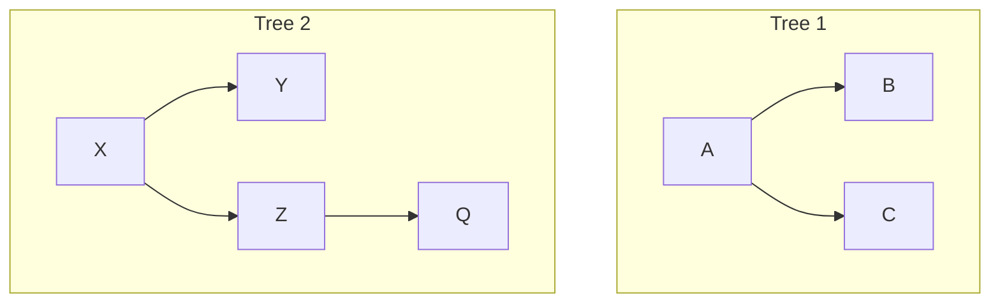

**Python Implementation**
```python
# Forest represented as adjacency list with multiple components
forest_adj = {
    1: [2, 3], 2: [], 3: [],  # Tree 1
    4: [5], 5: [6], 6: []     # Tree 2
}

def count_trees_in_forest(adj):
    # Roots in a directed forest have indegree 0
    all_nodes = set(adj.keys())
    children = set(v for nbrs in adj.values() for v in nbrs)
    roots = all_nodes - children
    return list(roots)

print(f"Roots: {count_trees_in_forest(forest_adj)}") # [1, 4]
```

---

## 5. Subtrees, Ancestors, Descendants

**Explanation**
*   **Subtree:** A node $v$ and all its descendants.
*   **Ancestor:** Any node on the path from root to $v$.
*   **Descendant:** Any node reachable from $v$ (in a rooted context).

**Mermaid Diagram**
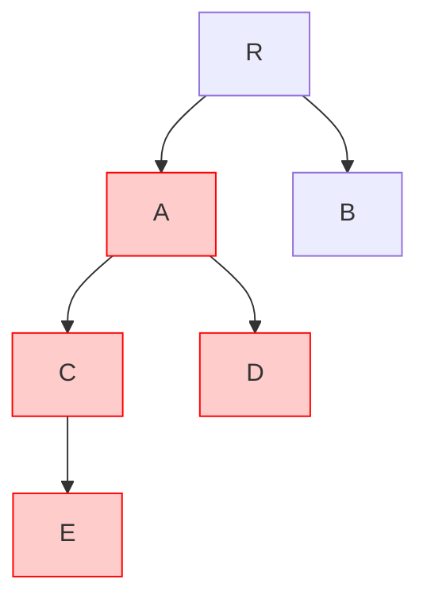

**Python Implementation**
```python
def get_descendants(node_val, adj):
    # BFS to find all nodes reachable from node_val
    descendants = []
    queue = [node_val]
    while queue:
        curr = queue.pop(0)
        # Assuming directed adjacency list (parent -> children)
        if curr in adj:
            for child in adj[curr]:
                descendants.append(child)
                queue.append(child)
    return descendants

tree_adj = {"R": ["A", "B"], "A": ["C", "D"], "C": ["E"], "B": [], "D": [], "E": []}
print(f"Subtree of A: {['A'] + get_descendants('A', tree_adj)}")
```

---

## 6. Paths, Routes, and Walks

**Explanation**
*   **Walk:** Can repeat edges and vertices ($A \to B \to A \to C$).
*   **Trail:** Can repeat vertices, but **no** repeated edges.
*   **Simple Path:** **No** repeated vertices ($A \to B \to C$).

**Mermaid Diagram**
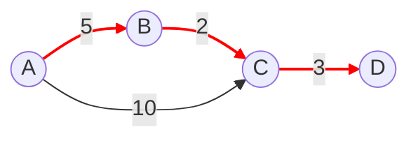

**Python Implementation**
```python
def is_valid_walk(graph, sequence):
    # Check if edges exist between consecutive nodes
    for i in range(len(sequence) - 1):
        u, v = sequence[i], sequence[i+1]
        if v not in graph.get(u, []):
            return False
    return True

g = {"A": ["B", "C"], "B": ["C", "D"], "C": ["D"], "D": []}
print(is_valid_walk(g, ["A", "B", "C", "D"])) # True
print(is_valid_walk(g, ["A", "D"]))           # False (No edge A->D)
```

---

## 7. Cycles and Cycle Detection

**Explanation**
*   **Undirected:** A path starting and ending at the same node with length $>2$.
*   **Directed:** A path $v_1 \to \dots \to v_k \to v_1$.
*   **Detection:**
    *   Undirected: DFS (if we see a visited neighbor that isn't our direct parent).
    *   Directed: DFS (check recursion stack for "back edges").

**Mermaid Diagram**
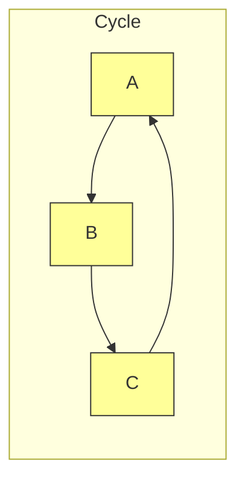

**Python Implementation**
```python
# Directed Cycle Detection (White-Gray-Black DFS)
def has_cycle_directed(adj):
    # 0: Unvisited, 1: Visiting (in stack), 2: Visited
    state = {u: 0 for u in adj}
    
    def dfs(u):
        state[u] = 1 # Mark gray
        for v in adj.get(u, []):
            if state[v] == 1: # Found back-edge to ancestor
                return True
            if state[v] == 0:
                if dfs(v): return True
        state[u] = 2 # Mark black
        return False

    for node in adj:
        if state[node] == 0:
            if dfs(node): return True
    return False

cycle_graph = {"A": ["B"], "B": ["C"], "C": ["A"]}
print(f"Has Cycle: {has_cycle_directed(cycle_graph)}")
```

---

## 8. Connected Components

**Explanation**
*   **Undirected:** A maximal set of vertices where path exists between every pair.
*   **Strongly Connected (Directed):** Path from $u \to v$ AND $v \to u$.
*   **Weakly Connected (Directed):** Connected if we ignore edge direction.

**Mermaid Diagram**
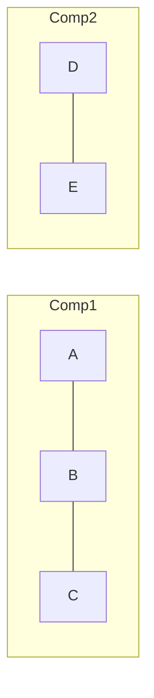

**Python Implementation**
```python
def find_components(adj):
    visited = set()
    components = []
    
    for node in adj:
        if node not in visited:
            # Start a traversal (BFS/DFS) for new component
            comp = []
            stack = [node]
            visited.add(node)
            while stack:
                u = stack.pop()
                comp.append(u)
                for v in adj[u]:
                    if v not in visited:
                        visited.add(v)
                        stack.append(v)
            components.append(comp)
    return components

print(find_components({1:[2], 2:[1], 3:[4], 4:[3]})) # [[1, 2], [3, 4]]
```

---

## 9. Planarity

**Explanation**
*   **Planar Graph:** Can be drawn on a 2D plane without edges crossing.
*   **Kuratowski's Theorem:** A graph is non-planar if it contains a subdivision of $K_5$ (complete graph of 5) or $K_{3,3}$ (complete bipartite).

**Mermaid Diagram**
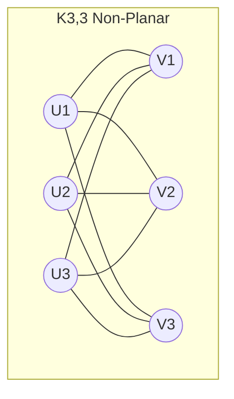

**Python Note:** Planarity testing is complex ($O(N)$ Hopcroft-Tarjan). Usually simpler to use a library.
```python
import networkx as nx

K3_3 = nx.complete_bipartite_graph(3, 3)
is_planar, _ = nx.check_planarity(K3_3)
print(f"K3,3 Planar? {is_planar}") # False
```

---

## 10. Isomorphism

**Explanation**
*   Two graphs $G$ and $H$ are **isomorphic** if they are structurally identical (ignoring labels).
*   There exists a bijection $f: V(G) \to V(H)$ such that $(u, v) \in E(G) \iff (f(u), f(v)) \in E(H)$.

**Mermaid Diagram**
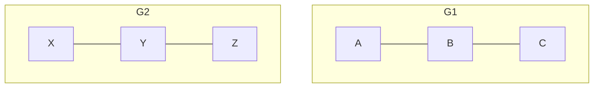

**Python Implementation (Rooted Tree Canonization)**
```python
# Encodes tree structure to string tuples. 
# If tuples are equal, rooted trees are isomorphic.
def encode_tree(node):
    if not node.children:
        return "()"
    
    # Sort children encodings to handle order invariance
    child_codes = sorted([encode_tree(c) for c in node.children])
    return "(" + "".join(child_codes) + ")"
```

---

## 11. Graph Coloring

**Explanation**
*   **Vertex Coloring:** Assign colors to vertices such that no two adjacent vertices share the same color.
*   **Chromatic Number $\chi(G)$:** Minimal number of colors needed.
*   **Bipartite Graph:** $\chi(G) = 2$.

**Mermaid Diagram**
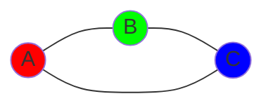

**Python Implementation (Greedy Coloring)**
```python
def greedy_color(adj):
    colors = {} # node -> color_index
    
    # Simple ordering (can be optimized)
    for u in adj:
        neighbor_colors = {colors[v] for v in adj[u] if v in colors}
        
        # Find first available color
        color = 0
        while color in neighbor_colors:
            color += 1
        colors[u] = color
        
    return colors

g_adj = {"A": ["B", "C"], "B": ["A", "C"], "C": ["A", "B"]} # Triangle
print(greedy_color(g_adj)) # {'A': 0, 'B': 1, 'C': 2}
```