# Part 2

## 1. Binary Trees: Structure & Traversals

**Explanation**
*   **Structure:** Each node has at most two children (Left, Right).
*   **Traversals:**
    *   *Preorder (DFS):* Root $\to$ Left $\to$ Right.
    *   *Inorder (DFS):* Left $\to$ Root $\to$ Right.
    *   *Postorder (DFS):* Left $\to$ Right $\to$ Root.
    *   *Level-order (BFS):* Level by level, left to right.

**Mermaid Diagram**
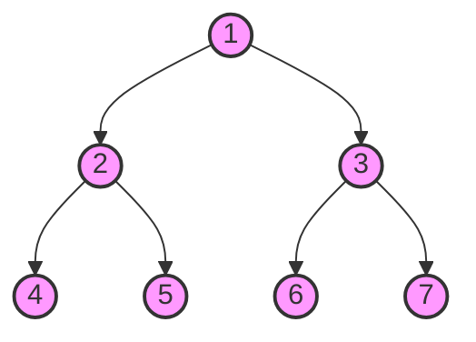

**Python Implementation**
```python
class Node:
    def __init__(self, val, left=None, right=None):
        self.val = val; self.left = left; self.right = right

def traversals(root):
    def preorder(r): return [r.val] + preorder(r.left) + preorder(r.right) if r else []
    def inorder(r):  return inorder(r.left) + [r.val] + inorder(r.right) if r else []
    def postorder(r): return postorder(r.left) + postorder(r.right) + [r.val] if r else []
    
    return preorder(root), inorder(root), postorder(root)

from collections import deque
def level_order(root):
    if not root: return []
    q, res = deque([root]), []
    while q:
        node = q.popleft()
        res.append(node.val)
        if node.left: q.append(node.left)
        if node.right: q.append(node.right)
    return res

# Construct tree from diagram
root = Node(1, Node(2, Node(4), Node(5)), Node(3, Node(6), Node(7)))
print(level_order(root)) # [1, 2, 3, 4, 5, 6, 7]
```

---

## 2. Binary Search Trees (BST)

**Explanation**
*   **Invariant:** For any node $N$: `max(N.left.subtree) < N.val < min(N.right.subtree)`.
*   **Operations:** Search, Insert, and Delete operate in $O(h)$ time (height of tree).
*   **Worst Case:** $O(N)$ if the tree becomes a linked list (skewed).

**Mermaid Diagram**
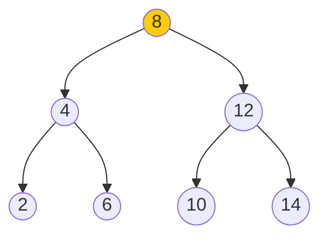

**Python Implementation**
```python
def bst_insert(root, val):
    if not root: return Node(val)
    if val < root.val: root.left = bst_insert(root.left, val)
    else: root.right = bst_insert(root.right, val)
    return root

def bst_search(root, val):
    if not root or root.val == val: return root
    return bst_search(root.left, val) if val < root.val else bst_search(root.right, val)

def bst_delete(root, val):
    if not root: return root
    if val < root.val: root.left = bst_delete(root.left, val)
    elif val > root.val: root.right = bst_delete(root.right, val)
    else:
        # Node with only one child or no child
        if not root.left: return root.right
        if not root.right: return root.left
        # Node with two children: Get inorder successor (smallest in right subtree)
        temp = root.right
        while temp.left: temp = temp.left
        root.val = temp.val
        root.right = bst_delete(root.right, temp.val)
    return root
```

---

## 3. Balanced Trees (AVL, Red-Black)

**Explanation**
*   **Goal:** Maintain height $h \approx \log N$ to ensure fast operations.
*   **AVL:** Strict balance (balance factor $\in \{-1, 0, 1\}$). Uses rotations.
*   **Red-Black:** Relaxed balance (coloring rules). Less strictly balanced than AVL but faster insertion/deletion.
*   **Rotation:** A local structure change that preserves BST order but changes height.

**Mermaid Diagram (Right Rotation)**
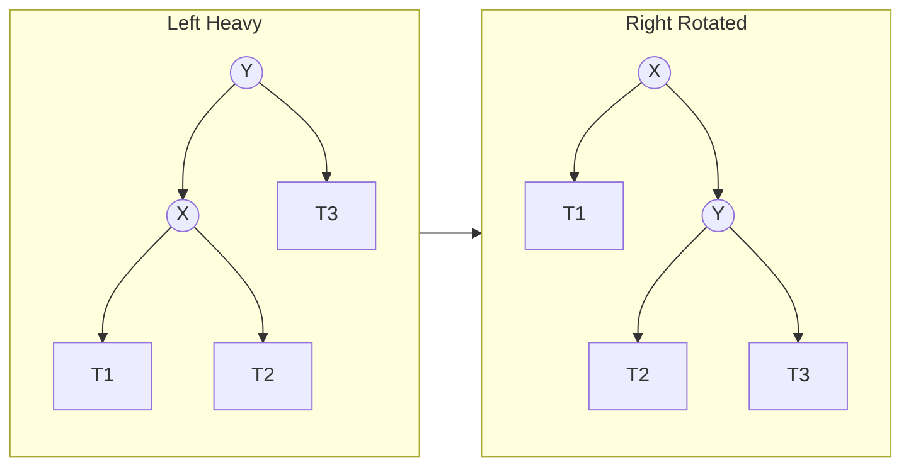

**Python Implementation (AVL Utilities)**
```python
class AVLNode(Node):
    def __init__(self, val):
        super().__init__(val)
        self.height = 1

def get_height(n): return n.height if n else 0
def get_balance(n): return get_height(n.left) - get_height(n.right) if n else 0

def right_rotate(y):
    x = y.left
    T2 = x.right
    # Perform rotation
    x.right = y
    y.left = T2
    # Update heights
    y.height = 1 + max(get_height(y.left), get_height(y.right))
    x.height = 1 + max(get_height(x.left), get_height(x.right))
    return x
```

---

## 4. N-ary Trees (General Trees)

**Explanation**
*   Nodes can have an arbitrary number of children.
*   Common in DOM trees (HTML), File Systems, and Organization charts.

**Mermaid Diagram**
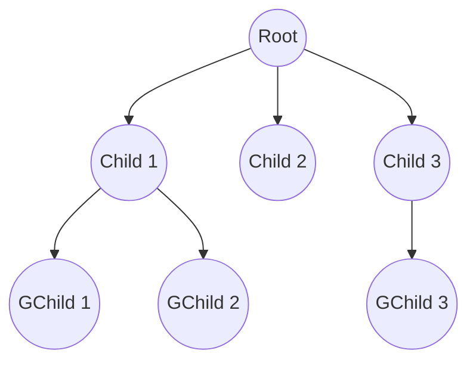

**Python Implementation**
```python
class NaryNode:
    def __init__(self, val, children=None):
        self.val = val
        self.children = children if children else []

def dfs_nary(root):
    if not root: return []
    result = [root.val]
    for child in root.children:
        result.extend(dfs_nary(child))
    return result

root = NaryNode("A", [NaryNode("B"), NaryNode("C", [NaryNode("D")])])
print(dfs_nary(root)) # ['A', 'B', 'C', 'D']
```

---

## 5. Heaps (Binary Heaps)

**Explanation**
*   **Property:** A Complete Binary Tree.
    *   Min-Heap: Parent $\le$ Children.
    *   Max-Heap: Parent $\ge$ Children.
*   **Storage:** Typically implemented as an array where children of $i$ are at $2i+1$ and $2i+2$.
*   **Use Cases:** Priority Queues, Dijkstra's Algorithm.

**Mermaid Diagram**
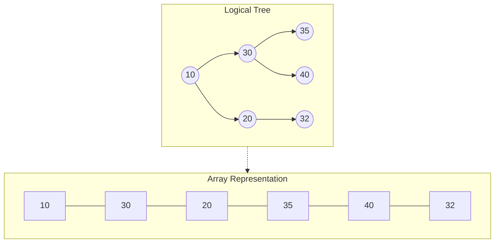

**Python Implementation**
```python
import heapq

# Python's heapq is a Min-Heap by default
data = [30, 10, 20, 35, 40, 32]
heapq.heapify(data)         # O(N) conversion
print(f"Min: {data[0]}")    # Peek: 10

heapq.heappush(data, 5)     # Push: O(log N)
min_val = heapq.heappop(data) # Pop: O(log N) -> 5
```

---

## 6. Trie (Prefix Tree)

**Explanation**
*   Optimized for string retrieval. Each edge represents a character.
*   Nodes share common prefixes (e.g., "cat" and "cap" share "c"-"a").
*   Useful for Autocomplete and Spell Checkers.

**Mermaid Diagram**
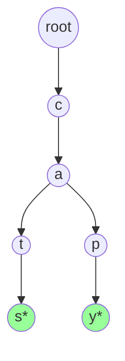

**Python Implementation**
```python
class TrieNode:
    def __init__(self):
        self.children = {}
        self.is_end = False

class Trie:
    def __init__(self): self.root = TrieNode()
    
    def insert(self, word):
        node = self.root
        for char in word:
            if char not in node.children:
                node.children[char] = TrieNode()
            node = node.children[char]
        node.is_end = True

    def search(self, word):
        node = self.root
        for char in word:
            node = node.children.get(char)
            if not node: return False
        return node.is_end
```

---

## 7. Segment Trees & Fenwick Trees

**Explanation**
*   **Segment Tree:** Full binary tree storing aggregate information (sum, min, max) for array intervals. $O(\log N)$ update and query.
*   **Fenwick Tree (BIT):** Uses bitwise operations to store prefix sums implicitly in an array. Lower constant factor and memory than SegTree, but less flexible.

**Mermaid Diagram (Segment Tree for Sum)**
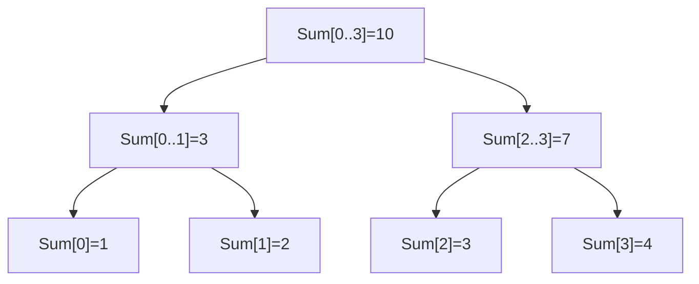

**Python Implementation (Fenwick)**
```python
class FenwickTree:
    def __init__(self, size):
        self.tree = [0] * (size + 1)

    def update(self, i, delta):
        while i < len(self.tree):
            self.tree[i] += delta
            i += i & (-i) # Move to next node

    def query(self, i):
        s = 0
        while i > 0:
            s += self.tree[i]
            i -= i & (-i) # Move to parent
        return s

ft = FenwickTree(10)
ft.update(1, 5) # Add 5 at index 1
print(ft.query(5)) # Prefix sum up to 5 -> 5
```

---

## 8. B-Trees & B+ Trees (Disk Based)

**Explanation**
*   **B-Tree:** Balanced multi-way search tree. Nodes have multiple keys and children. Optimized to minimize disk I/O (height is very small).
*   **B+ Tree:** Keys are stored in internal nodes for navigation, but *data records* are stored only at leaves. Leaves are linked for efficient range scans.

**Mermaid Diagram**
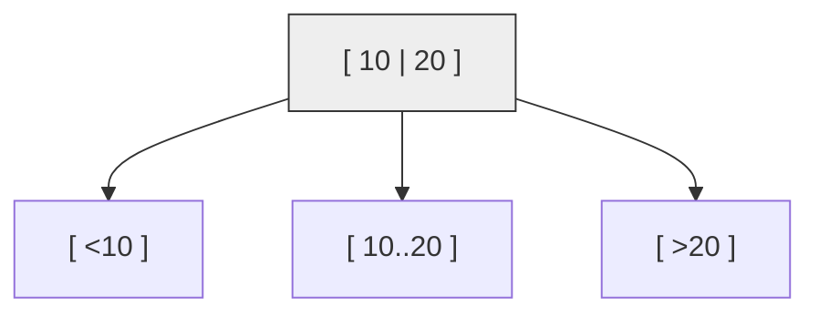

**Python Implementation (Node structure sketch)**
```python
class BTreeNode:
    def __init__(self, t, leaf=False):
        self.t = t  # Min degree
        self.keys = []
        self.children = []
        self.leaf = leaf

    # Full implementation involves splitting full children 
    # and merging nodes, which is verbose.
```

---

## 9. Treaps

**Explanation**
*   **Treap:** (Tree + Heap).
*   Nodes contain a **Key** (BST property) and a **Priority** (Heap property).
*   Priorities are assigned randomly. This yields a balanced tree with high probability without strict structural rules.

**Mermaid Diagram**
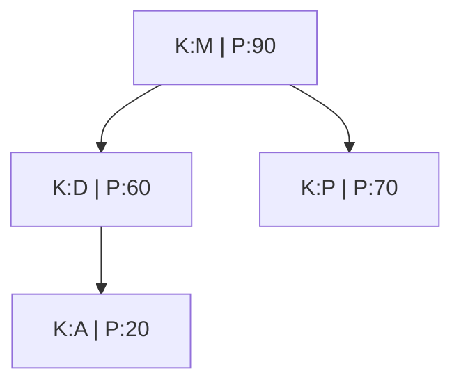

**Python Implementation**
```python
import random

class TreapNode:
    def __init__(self, key):
        self.key = key
        self.priority = random.random()
        self.left = None
        self.right = None
        
# Insertion involves standard BST insert followed by 
# rotations to restore Heap property based on priority.
```

---

## 10. Patricia / Compressed Tries

**Explanation**
*   **Radix/Patricia Tree:** A space-optimized Trie.
*   Nodes with a single child are merged with their parent. Edges are labeled with strings (substrings) rather than single characters.

**Mermaid Diagram**
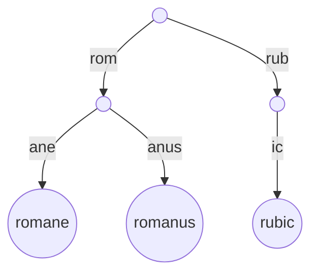

**Python Concept**
```python
# Instead of children['a'], children['b']...
# Children is a map of string -> Node
# children = { "rom": Node(...), "rub": Node(...) }
```

---

## 11. Threaded Binary Trees

**Explanation**
*   Utilizes null pointers in a standard Binary Tree.
*   **Right Null** points to Inorder Successor.
*   **Left Null** points to Inorder Predecessor.
*   Allows traversal without recursion or a stack.

**Mermaid Diagram**
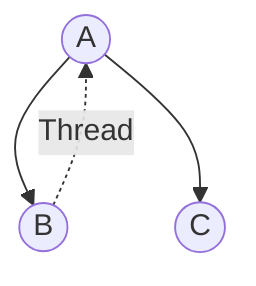

**Python Concept**
```python
class ThreadedNode:
    def __init__(self, val):
        self.val = val
        self.left = None
        self.right = None
        self.is_threaded = False # True if right points to successor
```

---

## 12. Successor / Predecessor

**Explanation**
*   **Successor:** The node with the smallest key greater than the input node.
*   **Logic:**
    1.  If Right Subtree exists $\to$ Min(Right Subtree).
    2.  Else $\to$ Travel up ancestor chain until you come from a *left* child.

**Mermaid Diagram**
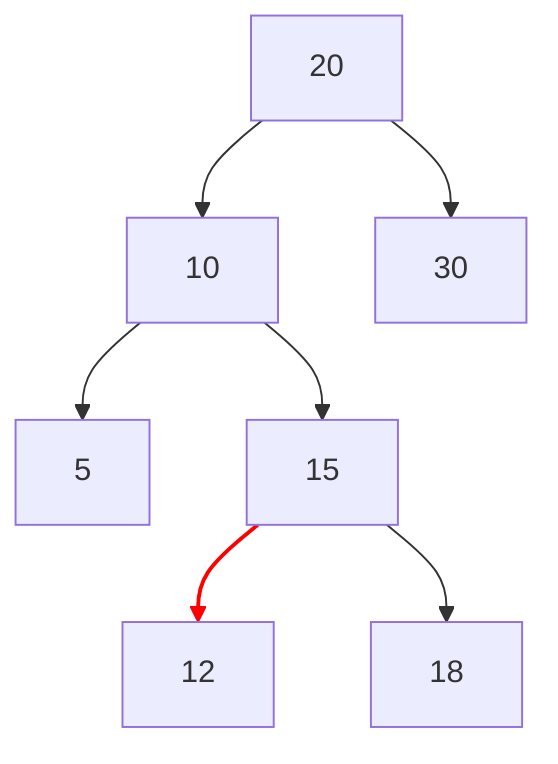

**Python Implementation**
```python
def inorder_successor(root, target):
    successor = None
    while root:
        if target.val < root.val:
            successor = root
            root = root.left
        else:
            root = root.right
    return successor
```

---

## 13. Tree Representations

**Explanation**
1.  **Node Objects:** Standard `self.left`, `self.right`.
2.  **Array (Implicit):** Used for heaps. $Left=2i, Right=2i+1$.
3.  **LCRS (Left-Child Right-Sibling):** Representing N-ary trees using binary nodes.
4.  **Adjacency List:** Generic graph format (node $\to$ list of neighbors).

**Mermaid Diagram (LCRS)**
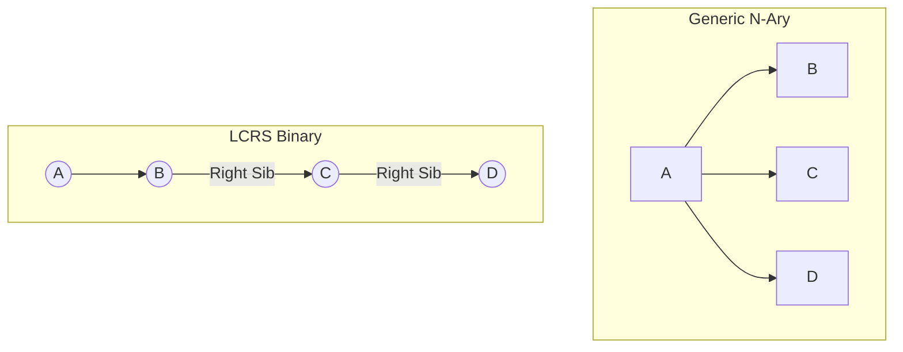

**Python Implementation (Array to Tree)**
```python
# Array representation (1-based indexing for math simplicity)
tree_arr = [None, "A", "B", "C", "D", "E"]

def get_children_indices(i, size):
    l, r = 2*i, 2*i+1
    return (l if l < size else None, r if r < size else None)

print(get_children_indices(1, len(tree_arr))) # (2, 3) -> Indices of B and C
```