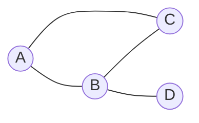
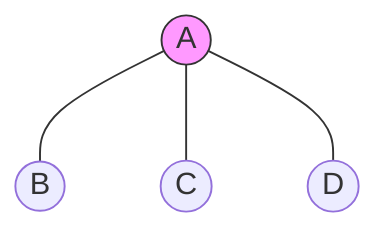
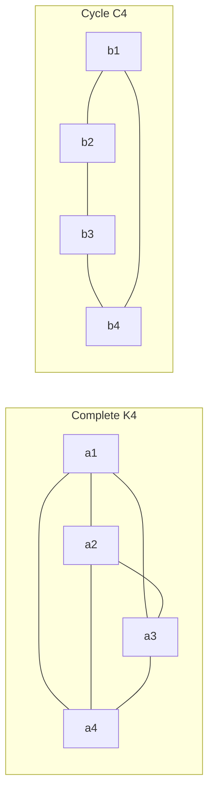
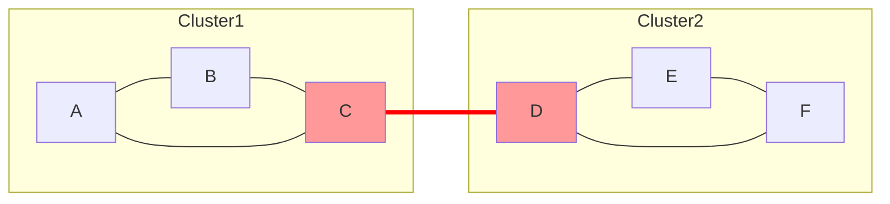
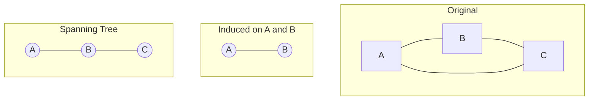
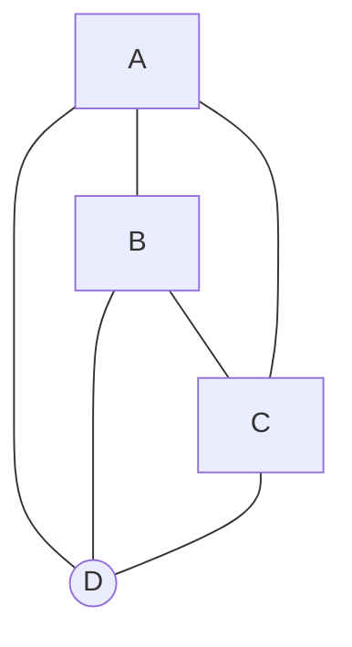
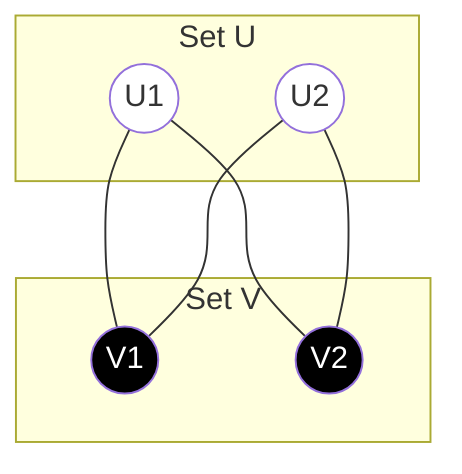
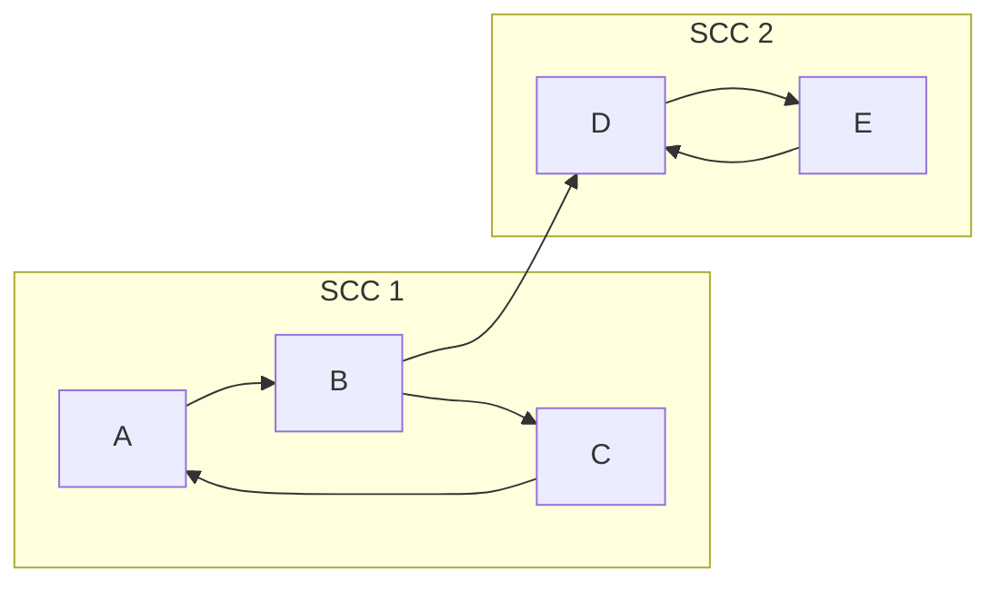
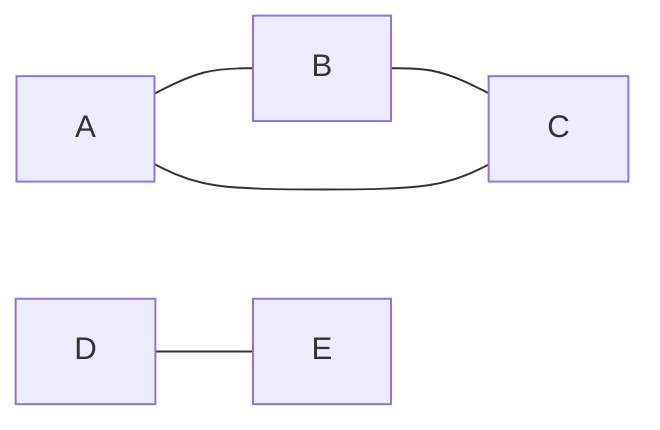

# Part 3

## 1. Graph Representations

**Explanation**
*   **Adjacency List:** A dictionary or array where `adj[u]` contains a list of neighbors.
    *   *Space:* $O(V+E)$. Best for sparse graphs.
    *   *Lookup:* $O(\text{deg}(u))$ to check if $(u,v)$ exists.
*   **Adjacency Matrix:** A 2D array where `M[u][v] = 1` (or weight).
    *   *Space:* $O(V^2)$. Best for dense graphs.
    *   *Lookup:* $O(1)$.

**Mermaid Diagram**


**Python Implementation**
```python
# 1. Adjacency List (Dictionary of Lists)
# Space Efficient
adj_list = {
    0: [1, 2],
    1: [0, 2, 3],
    2: [0, 1],
    3: [1]
}

# 2. Adjacency Matrix (2D List)
# O(1) Edge Lookup
num_nodes = 4
adj_matrix = [[0] * num_nodes for _ in range(num_nodes)]

edges = [(0,1), (0,2), (1,2), (1,3)]
for u, v in edges:
    adj_matrix[u][v] = 1
    adj_matrix[v][u] = 1 # Symmetric for undirected

print(adj_matrix[1][3]) # 1 (Edge exists)
```

---

## 2. Terminology: Vertices, Edges, Degree

**Explanation**
*   **Vertex (Node):** Fundamental unit.
*   **Edge (Link):** Connection between vertices.
*   **Degree:** Number of edges incident to a vertex.
    *   In Directed graphs: **Indegree** (incoming) vs. **Outdegree** (outgoing).
*   **Handshaking Lemma:** $\sum \text{deg}(v) = 2 \times |E|$.

**Mermaid Diagram**


**Python Implementation**
```python
def get_degrees(adj):
    # Returns dictionary {node: degree}
    return {u: len(neighbors) for u, neighbors in adj.items()}

graph = {"A": ["B", "C", "D"], "B": ["A"], "C": ["A"], "D": ["A"]}
print(get_degrees(graph)) # {'A': 3, 'B': 1, 'C': 1, 'D': 1}
```

---

## 3. Special Graphs

**Explanation**
*   **Complete ($K_n$):** Every pair of vertices is connected. Edges = $n(n-1)/2$.
*   **Cycle ($C_n$):** A closed path of $n$ vertices.
*   **Complete Bipartite ($K_{m,n}$):** Vertices partitioned into sets $M, N$; every node in $M$ connects to every node in $N$.

**Mermaid Diagram**


**Python Implementation**
```python
def generate_complete_graph(n):
    return {i: [j for j in range(n) if i != j] for i in range(n)}

K_3 = generate_complete_graph(3)
print(K_3) # {0: [1, 2], 1: [0, 2], 2: [0, 1]}
```

---

## 4. Connectivity: Articulation Points & Bridges

**Explanation**
*   **Articulation Point (Cut Vertex):** A vertex whose removal increases the number of connected components.
*   **Bridge (Cut Edge):** An edge whose removal disconnects the graph.
*   **Algorithm:** DFS maintaining `discovery_time` and `low_link` values (Tarjan's or Hopcroft-Tarjan).

**Mermaid Diagram**


**Python Implementation (Bridges)**
```python
def find_bridges(adj):
    timer = 0
    tin, low = {}, {} # Time In, Low Link
    bridges = []
    
    def dfs(u, p=-1):
        nonlocal timer
        tin[u] = low[u] = timer
        timer += 1
        for v in adj[u]:
            if v == p: continue
            if v in tin:
                low[u] = min(low[u], tin[v]) # Back-edge
            else:
                dfs(v, u)
                low[u] = min(low[u], low[v])
                if low[v] > tin[u]:
                    bridges.append((u, v))

    for node in adj:
        if node not in tin: dfs(node)
    return bridges
```

---

## 5. Subgraphs: Induced vs. Spanning

**Explanation**
*   **Subgraph:** Subset of vertices and edges.
*   **Induced Subgraph:** Subset of vertices $V'$ and *all* original edges connecting vertices in $V'$.
*   **Spanning Subgraph:** Contains *all* vertices $V$ but only a subset of edges (e.g., Spanning Tree).

**Mermaid Diagram**


**Python Implementation**
```python
def get_induced_subgraph(graph, nodes):
    subset = set(nodes)
    subgraph = {}
    for u in nodes:
        # Keep neighbors only if they are in the requested subset
        subgraph[u] = [v for v in graph[u] if v in subset]
    return subgraph

g = {"A":["B","C"], "B":["A","C"], "C":["A","B"]}
print(get_induced_subgraph(g, ["A", "B"])) # Keeps edge A-B
```

---

## 6. Planar Graphs & Euler's Formula

**Explanation**
*   **Planar Graph:** Can be drawn without edge crossings.
*   **Euler's Formula:** For a connected planar graph: $V - E + F = 2$ (where $F$ is the number of faces/regions, including the outer infinite region).
*   **Constraint:** If $V \ge 3$, then $E \le 3V - 6$.

**Mermaid Diagram**


**Python Implementation**
```python
def check_euler_invariant(V, E, F):
    return V - E + F == 2

# Example: Cube (Planar)
# 8 Vertices, 12 Edges, 6 Faces
print(check_euler_invariant(8, 12, 6)) # True
```

---

## 7. Bipartite Graphs & 2-Coloring

**Explanation**
*   **Bipartite:** Vertices can be split into two sets ($U, V$) such that every edge connects a node in $U$ to one in $V$.
*   **Property:** Contains **no odd cycles**.
*   **2-Coloring:** Can be colored with 2 colors (0 and 1) such that no neighbors share a color.

**Mermaid Diagram**


**Python Implementation (BFS)**
```python
def is_bipartite(adj):
    color = {} # Maps node -> 0 or 1
    for node in adj:
        if node in color: continue
        queue = [node]
        color[node] = 0
        while queue:
            u = queue.pop(0)
            for v in adj[u]:
                if v not in color:
                    color[v] = 1 - color[u]
                    queue.append(v)
                elif color[v] == color[u]:
                    return False # Conflict found
    return True
```

---

## 8. Matrix Representations: Incidence

**Explanation**
*   **Adjacency Matrix ($A$):** $A_{ij} = 1$ if connected.
*   **Incidence Matrix ($B$):** Rows = Vertices, Cols = Edges.
    *   Undirected: $B_{ve} = 1$ if vertex $v$ is part of edge $e$.
    *   Directed: $B_{ve} = -1$ (source), $1$ (destination), $0$ (otherwise).

**Python Implementation**
```python
import numpy as np

# Directed Incidence Matrix
# Edge 0: A->B, Edge 1: B->C
nodes = ["A", "B", "C"]
edges = [("A", "B"), ("B", "C")]

inc_mat = np.zeros((len(nodes), len(edges)))

for e_idx, (u, v) in enumerate(edges):
    u_idx, v_idx = nodes.index(u), nodes.index(v)
    inc_mat[u_idx][e_idx] = -1 # Source
    inc_mat[v_idx][e_idx] = 1  # Sink

# Row 0 (A): [-1,  0]
# Row 1 (B): [ 1, -1]
# Row 2 (C): [ 0,  1]
```

---

## 9. Digraphs: Strong Connectivity (SCC)

**Explanation**
*   **Strongly Connected Component (SCC):** Maximal set of vertices where every vertex is reachable from every other vertex in the set.
*   **Weakly Connected:** Connected if edge directions are ignored.
*   **Kosaraju's Algorithm:** Two-pass DFS. 1. Order by finish time. 2. DFS on transpose graph (reversed edges).

**Mermaid Diagram**


**Python Implementation (Kosaraju)**
```python
def get_sccs(adj):
    # 1. DFS to get finish order
    visited, stack = set(), []
    def dfs1(u):
        visited.add(u)
        for v in adj.get(u, []):
            if v not in visited: dfs1(v)
        stack.append(u)
    
    for n in adj: 
        if n not in visited: dfs1(n)
        
    # 2. Transpose Graph
    adj_rev = {u:[] for u in adj}
    for u in adj:
        for v in adj[u]: adj_rev[v].append(u)
        
    # 3. DFS on Transpose
    visited.clear()
    sccs = []
    def dfs2(u, component):
        visited.add(u); component.append(u)
        for v in adj_rev[u]:
            if v not in visited: dfs2(v, component)
            
    while stack:
        node = stack.pop()
        if node not in visited:
            comp = []
            dfs2(node, comp)
            sccs.append(comp)
    return sccs
```

---

## 10. Degree Sequences (Havel-Hakimi)

**Explanation**
*   **Degree Sequence:** List of degrees of all vertices in descending order.
*   **Graphical:** A sequence is "graphical" if a simple graph can be formed from it.
*   **Havel-Hakimi Algorithm:** Sort list, pop largest $d$, subtract 1 from next $d$ elements. If any value $<0$, impossible. Repeat.

**Mermaid Diagram**


**Python Implementation**
```python
def is_graphical(sequence):
    seq = sorted(sequence, reverse=True)
    while True:
        # Remove zeros (isolated nodes don't affect validity)
        seq = [x for x in seq if x > 0]
        if not seq: return True # All satisfied
        
        seq.sort(reverse=True)
        d = seq.pop(0) # Highest degree node
        
        if d > len(seq): return False # Not enough neighbors
        
        # Connect to next d nodes
        for i in range(d):
            seq[i] -= 1
            if seq[i] < 0: return False
            
print(is_graphical([2, 2, 2, 1, 1])) # True
print(is_graphical([3, 3, 3]))       # False (Requires K3, need [2,2,2])
```