# Part 4

## 1. Fundamental Theorems

**Explanation**
*   **Tree Characterization:** An undirected graph is a tree if it is connected and acyclic ($|E| = |V| - 1$).
*   **Euler’s Formula:** For a connected planar graph, $V - E + F = 2$.
*   **Kuratowski's Theorem:** A graph is non-planar iff it contains a subdivision of $K_5$ or $K_{3,3}$.
*   **Isomorphism:** Tree isomorphism is solvable in linear time ($O(N)$) using canonical labeling (AHU algorithm).

**Mermaid Diagram**
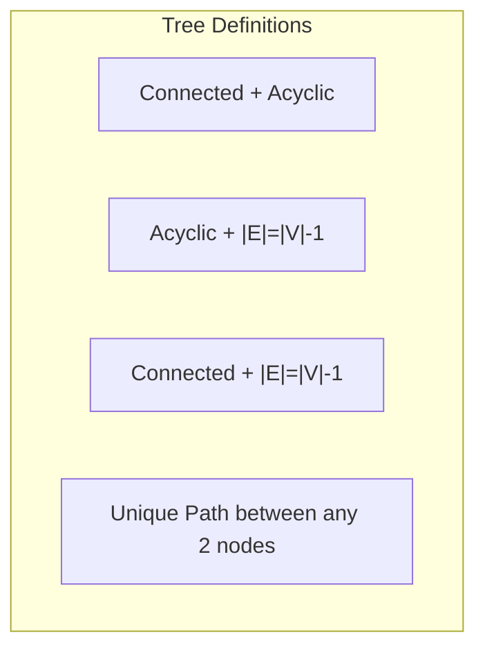

**Python Check (Is Tree)**
```python
def is_valid_tree(adj):
    # 1. Check Edges Count
    num_nodes = len(adj)
    num_edges = sum(len(v) for v in adj.values()) // 2
    if num_edges != num_nodes - 1: return False
    
    # 2. Check Connectivity (BFS)
    start = next(iter(adj))
    visited = {start}
    queue = [start]
    while queue:
        u = queue.pop(0)
        for v in adj[u]:
            if v not in visited:
                visited.add(v)
                queue.append(v)
    return len(visited) == num_nodes
```

---

## 2. Tree Traversals (Iterative)

**Explanation**
*   **Preorder:** Root $\to$ Left $\to$ Right.
*   **Inorder:** Left $\to$ Root $\to$ Right.
*   **Postorder:** Left $\to$ Right $\to$ Root.
*   **Morris Traversal:** $O(1)$ space using threading (modifying pointers temporarily).

**Mermaid Diagram (Inorder Path)**
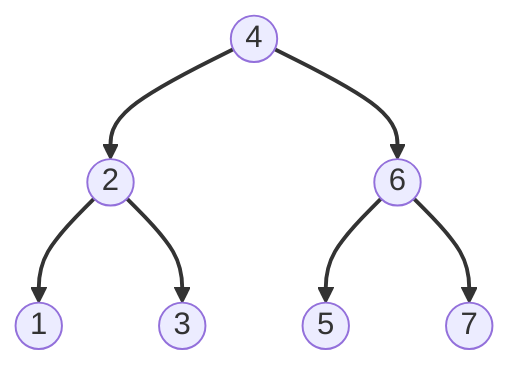

**Python Implementation (Iterative Inorder)**
```python
def inorder_iterative(root):
    stack, result = [], []
    curr = root
    while stack or curr:
        while curr:
            stack.append(curr)
            curr = curr.left
        curr = stack.pop()
        result.append(curr.val)
        curr = curr.right
    return result
```

---

## 3. Recursive Ops: Height, Size, Leaves

**Explanation**
*   **Height:** Max depth from root to leaf.
*   **Size:** Total number of nodes.
*   **Leaf:** Node with no children.

**Mermaid Diagram**
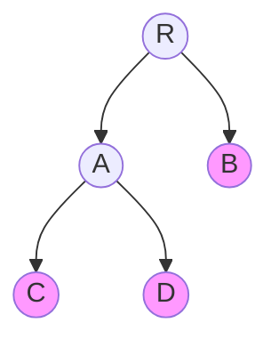

**Python Implementation**
```python
def tree_stats(node):
    if not node: return 0, 0, 0 # height, size, leaves
    
    h_l, s_l, l_l = tree_stats(node.left)
    h_r, s_r, l_r = tree_stats(node.right)
    
    height = 1 + max(h_l, h_r)
    size = 1 + s_l + s_r
    leaves = l_l + l_r if (node.left or node.right) else 1
    
    return height, size, leaves
```

---

## 4. Tree DP (Subtree Queries)

**Explanation**
*   **Bottom-Up DP:** Compute value for a node based on its children.
*   **Rerooting:** Compute result for *every* node as root in two passes (Upward then Downward).

**Mermaid Diagram (Subtree Sum)**
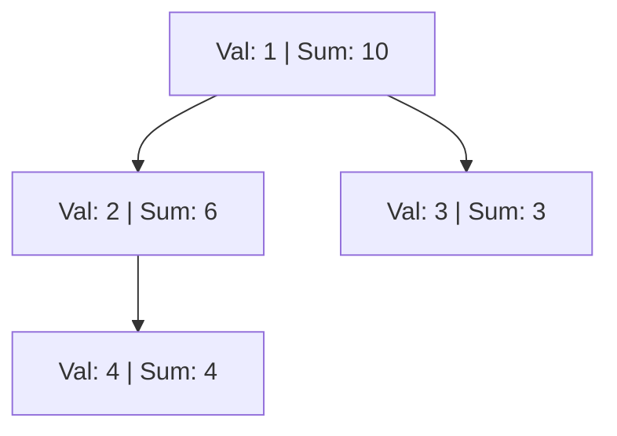

**Python Implementation**
```python
# Assuming Node has a 'val' attribute
def compute_subtree_sum(node):
    if not node: return 0
    
    current_sum = node.val + compute_subtree_sum(node.left) + compute_subtree_sum(node.right)
    node.subtree_sum = current_sum # Store for DP
    return current_sum
```

---

## 5. Lowest Common Ancestor (LCA)

**Explanation**
*   **LCA(u, v):** The deepest node that is an ancestor of both $u$ and $v$.
*   **Binary Lifting:** Preprocess parents at powers of 2 ($2^0, 2^1, \dots$). Query in $O(\log N)$.

**Mermaid Diagram**
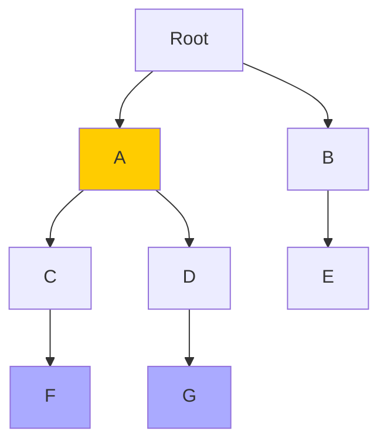

**Python Implementation (Binary Lifting Sketch)**
```python
import math

class LCA:
    def __init__(self, adj, root=0):
        self.n = len(adj)
        self.LOG = math.ceil(math.log2(self.n))
        self.up = [[-1] * self.n for _ in range(self.LOG)]
        self.depth = [0] * self.n
        self.adj = adj
        self.dfs(root, -1)
        
    def dfs(self, u, p):
        self.up[0][u] = p
        for i in range(1, self.LOG):
            if self.up[i-1][u] != -1:
                self.up[i][u] = self.up[i-1][self.up[i-1][u]]
        for v in self.adj[u]:
            if v != p:
                self.depth[v] = self.depth[u] + 1
                self.dfs(v, u)

    def query(self, u, v):
        if self.depth[u] < self.depth[v]: u, v = v, u
        
        # Lift u to same depth as v
        diff = self.depth[u] - self.depth[v]
        for i in range(self.LOG):
            if (diff >> i) & 1:
                u = self.up[i][u]
        
        if u == v: return u
        
        # Lift both until just below LCA
        for i in range(self.LOG-1, -1, -1):
            if self.up[i][u] != self.up[i][v]:
                u = self.up[i][u]
                v = self.up[i][v]
                
        return self.up[0][u]
```

---

## 6. Construction from Traversals

**Explanation**
*   **Preorder + Inorder:** Unique reconstruction.
*   **Postorder + Inorder:** Unique reconstruction.
*   **Preorder + Postorder:** Not unique (unless full binary tree).
*   **Concept:** Preorder gives root; Inorder splits left/right subtrees.

**Mermaid Diagram**
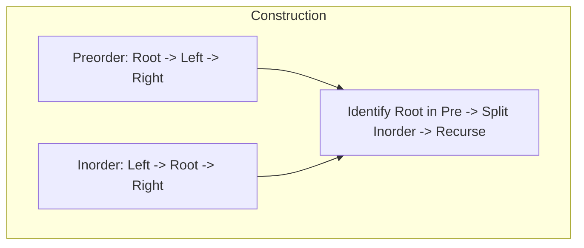

**Python Implementation**
```python
def build_tree(preorder, inorder):
    if not preorder or not inorder: return None
    
    root_val = preorder[0]
    root = BNode(root_val)
    mid = inorder.index(root_val)
    
    root.left = build_tree(preorder[1:mid+1], inorder[:mid])
    root.right = build_tree(preorder[mid+1:], inorder[mid+1:])
    return root
```

---

## 7. Path Queries & Heavy-Light Decomposition (HLD)

**Explanation**
*   **HLD:** Decomposes tree into "Heavy" paths (to child with largest subtree) and "Light" edges.
*   **Result:** Any path $u \to v$ passes through $O(\log N)$ heavy chains.
*   **Use:** Maps tree paths to array segments, allowing Segment Tree operations (Path Sum, Max) in $O(\log^2 N)$.

**Mermaid Diagram**
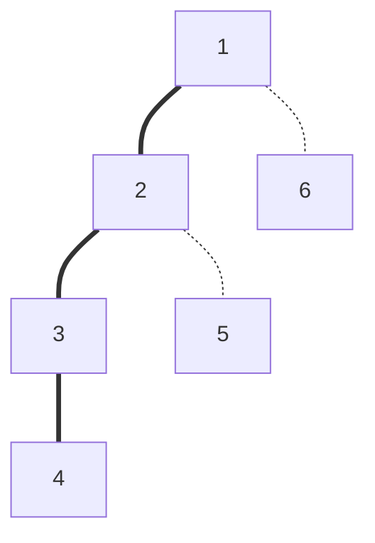

**Python Note:** Full implementation is extensive (100+ lines).
1.  `DFS1`: Compute size, depth, parent.
2.  `DFS2`: Assign `head` of chains and `pos` in segment tree array.
3.  `Query`: Climb up from $u$ and $v$ using `head` pointers until in same chain.

---

## 8. Tree Edit Distance & Isomorphism

**Explanation**
*   **Edit Distance:** Min operations (insert, delete, rename) to transform Tree A to Tree B. (Zhang-Shasha Algorithm).
*   **Isomorphism:** Use canonical string encoding (AHU). Sort children hashes to ensure structure order independence.

**Mermaid Diagram**
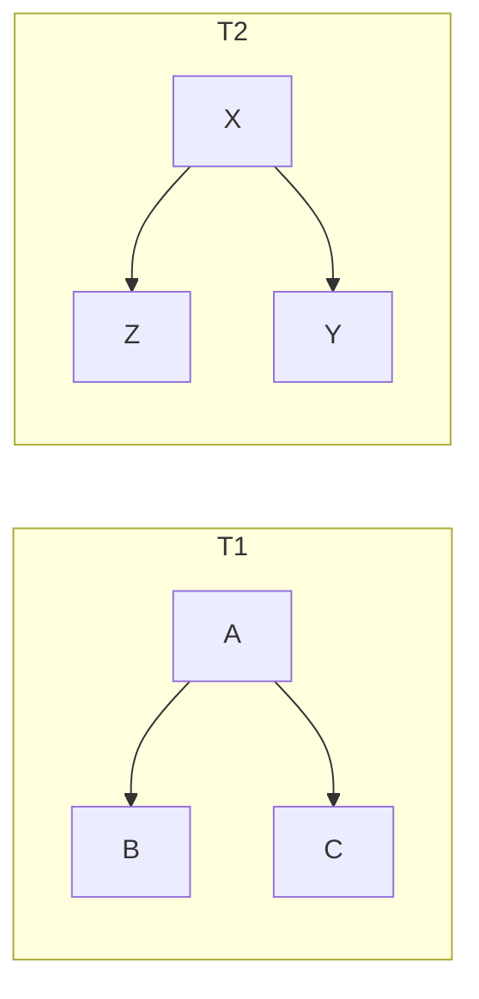

**Python Implementation (Isomorphism Hash)**
```python
def get_canonical_hash(node):
    if not node: return "("
    
    # Sort children to ignore order
    child_hashes = [get_canonical_hash(c) for c in node.children]
    child_hashes.sort()
    
    return "(" + "".join(child_hashes) + ")"

# If get_canonical_hash(root1) == get_canonical_hash(root2): Isomorphic
```

---

## 9. Balancing Rotations (AVL / RB)

**Explanation**
*   **Right Rotate:** Fixes Left-Heavy case.
*   **Left Rotate:** Fixes Right-Heavy case.
*   **Double Rotate:** (Left-Right or Right-Left) for "Dog-leg" shapes.

**Mermaid Diagram (Right Rotation)**
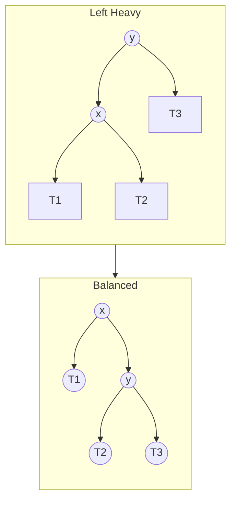

**Python Implementation (Right Rotate)**
```python
def rotate_right(y):
    x = y.left
    T2 = x.right
    x.right = y
    y.left = T2
    # Recalculate heights for x and y here
    return x
```

---

## 10. Tree Diameter

**Explanation**
*   **Diameter:** The longest path between *any* two nodes.
*   **Algorithm:**
    1.  BFS from random node $u$ to find farthest node $x$.
    2.  BFS from $x$ to find farthest node $y$.
    3.  Distance $d(x, y)$ is the diameter.

**Mermaid Diagram**
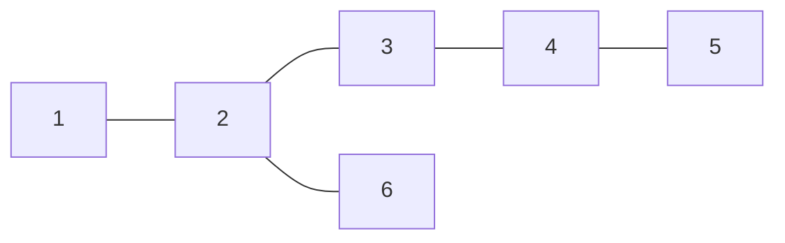

**Python Implementation**
```python
def get_diameter(adj):
    def bfs(start_node):
        dist = {start_node: 0}
        q = [start_node]
        farthest = start_node
        while q:
            u = q.pop(0)
            if dist[u] > dist[farthest]: farthest = u
            for v in adj[u]:
                if v not in dist:
                    dist[v] = dist[u] + 1
                    q.append(v)
        return farthest, dist[farthest]

    if not adj: return 0
    start = next(iter(adj))
    u, _ = bfs(start)
    v, diameter = bfs(u)
    return diameter
```

---

## 11. Pruning & Subtree Hashing

**Explanation**
*   **Pruning:** Stopping a search early if the current subtree cannot contain the answer (e.g., Minimax, Alpha-Beta).
*   **Subtree Hashing:** Assigning a unique ID to identical subtrees. $H(u) = \text{hash}(\text{val}(u) + \text{sorted}(\{H(v) \mid v \in children\}))$.

**Mermaid Diagram**
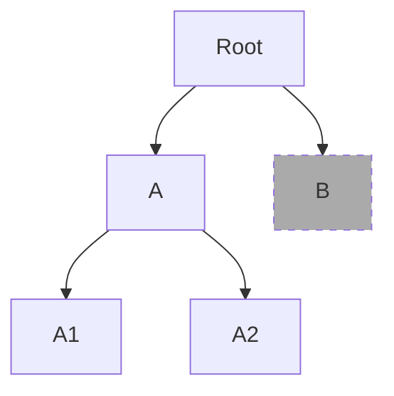

**Python Implementation (Simple Hash)**
```python
def subtree_hash(node):
    if not node: return "#"
    hashes = [subtree_hash(c) for c in node.children]
    hashes.sort()
    # Merkle-like hash construction
    return hash((node.val, tuple(hashes)))
```