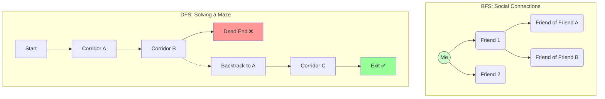
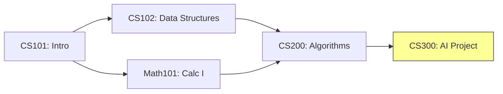
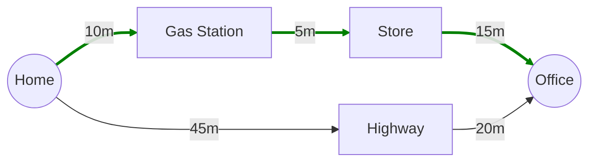
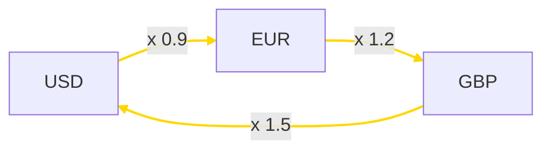
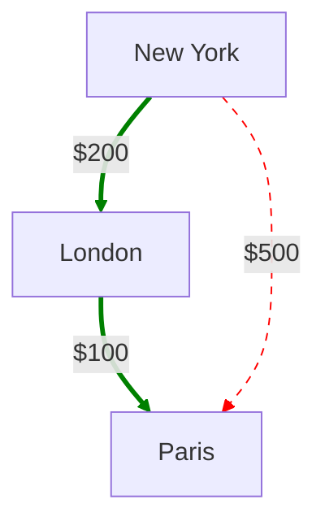
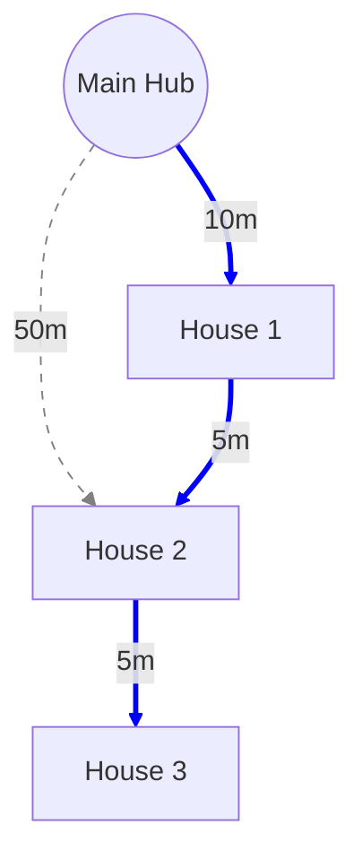
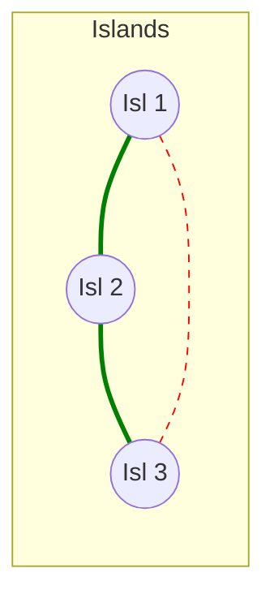
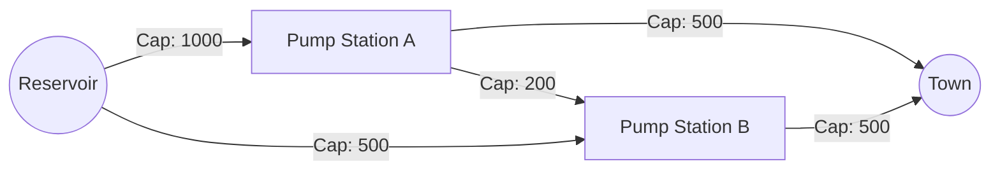
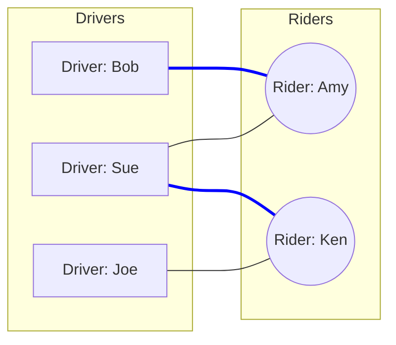
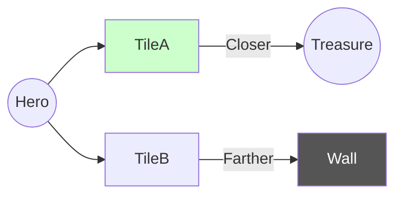

# Part 5

## 1. Breadth-First Search (BFS) & Depth-First Search (DFS)

**Abstract Concept**
*   **BFS:** Traverses a graph layer-by-layer. It uses a **Queue** (FIFO) to explore all neighbors of a node before moving deeper. It guarantees the shortest path in unweighted graphs.
*   **DFS:** Traverses a graph by plunging as deep as possible into one branch before backtracking. It uses a **Stack** (LIFO) or recursion. It is useful for cycle detection and connectivity checks.

**Real-World Example**
*   **BFS (Social Networks):** Used to find "Degrees of Separation" (e.g., LinkedIn 1st/2nd/3rd connections). It answers: "Who are my immediate friends?" before "Who are friends of friends?"
*   **DFS (Maze Solving):** Used to solve mazes. You walk down a corridor until you hit a wall, then backtrack to the last intersection and try a different path.

**Grounded Diagram**


**Python Implementation**
```python
from collections import deque

def bfs_friends(adj, me_node):
    queue = deque([me_node])
    seen = {me_node}
    while queue:
        person = queue.popleft()
        print(f"Visiting: {person}")
        for friend in adj[person]:
            if friend not in seen:
                seen.add(friend)
                queue.append(friend)

def dfs_maze(adj, current_room, visited=None):
    if visited is None: visited = set()
    visited.add(current_room)
    print(f"Exploring: {current_room}")
    for next_room in adj[current_room]:
        if next_room not in visited:
            dfs_maze(adj, next_room, visited)
```

---

## 2. Topological Sort

**Abstract Concept**
*   **Concept:** A linear ordering of vertices in a Directed Acyclic Graph (DAG) such that for every directed edge $u \to v$, vertex $u$ comes before $v$.
*   **Condition:** The graph must have no cycles.

**Real-World Example**
*   **University Course Prerequisites:** You cannot take "Calculus II" before "Calculus I". Topological sort determines a valid sequence of classes to graduate.

**Grounded Diagram**


**Python Implementation (Kahn's Algorithm)**
```python
def course_schedule(adj):
    # Calculate prerequisites count (in-degree)
    in_degree = {u: 0 for u in adj}
    for u in adj:
        for v in adj[u]:
            in_degree[v] += 1
            
    # Courses with no prereqs can start immediately
    queue = deque([u for u in in_degree if in_degree[u] == 0])
    order = []
    
    while queue:
        course = queue.popleft()
        order.append(course)
        for next_course in adj[course]:
            in_degree[next_course] -= 1
            if in_degree[next_course] == 0:
                queue.append(next_course)
                
    return order
```

---

## 3. Dijkstra’s Algorithm

**Abstract Concept**
*   **Concept:** Finds the shortest path from a source node to all other nodes in a graph with **non-negative weights**.
*   **Mechanism:** It is a greedy algorithm. It maintains a priority queue of "tentative distances" and always expands the unvisited node with the smallest known distance.

**Real-World Example**
*   **GPS Navigation:** Finding the fastest route from Home to Office. Edge weights represent travel time (minutes). Dijkstra ignores longer routes to focus on the most promising roads first.

**Grounded Diagram**


**Python Implementation**
```python
import heapq

def gps_navigate(adj, start_location):
    # Priority Queue stores (minutes, location)
    pq = [(0, start_location)]
    times = {loc: float('inf') for loc in adj}
    times[start_location] = 0
    
    while pq:
        current_time, u = heapq.heappop(pq)
        
        if current_time > times[u]: continue
        
        for v, travel_time in adj[u]:
            new_time = current_time + travel_time
            if new_time < times[v]:
                times[v] = new_time
                heapq.heappush(pq, (new_time, v))
    return times
```

---

## 4. Bellman-Ford Algorithm

**Abstract Concept**
*   **Concept:** Finds shortest paths from a single source, similar to Dijkstra, but handles **negative edge weights**.
*   **Mechanism:** It relaxes all edges $V-1$ times. If distances can still be reduced after $V-1$ iterations, the graph contains a **negative cycle**.

**Real-World Example**
*   **Currency Arbitrage:** In finance, exchange rates can be modeled as a graph. A "negative cycle" (in logarithmic terms) represents an infinite profit loop: convert USD $\to$ EUR $\to$ GBP $\to$ USD and end up with more money than you started with.

**Grounded Diagram**


**Python Implementation**
```python
def detect_arbitrage(rates, currencies, start_currency):
    # Using negative log of rates to find "shortest path" (highest product)
    dist = {c: float('inf') for c in currencies}
    dist[start_currency] = 0
    
    # Relax edges
    for _ in range(len(currencies) - 1):
        for u, v, weight in rates:
            if dist[u] + weight < dist[v]:
                dist[v] = dist[u] + weight
                
    # Check for profit loop (negative cycle)
    for u, v, weight in rates:
        if dist[u] + weight < dist[v]:
            return "Arbitrage Opportunity Detected!"
    return "Market is Stable"
```

---

## 5. Floyd-Warshall Algorithm

**Abstract Concept**
*   **Concept:** Computes shortest paths between **all pairs** of vertices.
*   **Mechanism:** Dynamic programming. It iteratively checks if going through an intermediate node $k$ improves the path between $i$ and $j$. Complexity is $O(V^3)$.

**Real-World Example**
*   **Airline Routing:** An airline wants to know the cheapest way to fly between any two cities. Is it cheaper to fly Direct (NY $\to$ Paris) or via a Hub (NY $\to$ London $\to$ Paris)?

**Grounded Diagram**


**Python Implementation**
```python
def flight_costs(matrix):
    n = len(matrix)
    cost = [row[:] for row in matrix]
    
    for k in range(n):         # Layover City
        for i in range(n):     # Origin
            for j in range(n): # Destination
                cost[i][j] = min(cost[i][j], cost[i][k] + cost[k][j])
    return cost
```

---

## 6. Prim’s Algorithm (MST)

**Abstract Concept**
*   **Concept:** Finds a Minimum Spanning Tree (MST) by growing a single tree from a starting node.
*   **Mechanism:** At each step, it adds the cheapest edge that connects a node *inside* the tree to a node *outside* the tree.

**Real-World Example**
*   **Fiber Optic Cabling:** A telecom company needs to wire a neighborhood. They start at the Main Hub and extend cables to the nearest houses, minimizing total wire length to save money.

**Grounded Diagram**


**Python Implementation**
```python
import heapq

def cable_layout_prim(adj, start_node):
    total_cable_len = 0
    connected = set()
    pq = [(0, start_node)] # (cable_length, house)
    
    while len(connected) < len(adj):
        length, u = heapq.heappop(pq)
        if u in connected: continue
        
        connected.add(u)
        total_cable_len += length
        
        for v, dist in adj[u]:
            if v not in connected:
                heapq.heappush(pq, (dist, v))
    return total_cable_len
```

---

## 7. Kruskal’s Algorithm (MST)

**Abstract Concept**
*   **Concept:** Finds an MST by sorting all edges by weight and adding them one by one.
*   **Mechanism:** It uses a **Union-Find** data structure to check if adding an edge creates a cycle. If it does, the edge is discarded.

**Real-World Example**
*   **Bridge Building:** A government wants to connect a set of islands. They evaluate all potential bridges and build the cheapest ones first, skipping any bridge that connects two islands already linked by a path.

**Grounded Diagram**


**Python Implementation**
```python
# Relies on Union-Find (DSU) helper functions
def build_bridges_kruskal(num_islands, possible_bridges):
    # bridge = (island_u, island_v, cost)
    possible_bridges.sort(key=lambda x: x[2]) # Sort by cost
    
    total_cost = 0
    dsu = UnionFind(num_islands)
    
    for u, v, cost in possible_bridges:
        if dsu.find(u) != dsu.find(v):
            dsu.union(u, v)
            total_cost += cost
            print(f"Build bridge between {u} and {v}")
            
    return total_cost
```

---

## 8. Network Flow (Max-Flow)

**Abstract Concept**
*   **Concept:** Determines the maximum amount of flow possible from a Source to a Sink in a network with capacity constraints.
*   **Mechanism:** Algorithms like Ford-Fulkerson or Edmonds-Karp find augmenting paths in the residual graph until no more flow can be pushed.

**Real-World Example**
*   **Water Pipe System:** Calculating the maximum gallons per minute that can flow from a Reservoir to a Town. The flow is limited by pipe diameters (capacities) and bottlenecks.

**Grounded Diagram**


**Python Concept**
```python
# Edmonds-Karp Algorithm logic
# 1. Find a path from Reservoir to Town with available space using BFS.
# 2. Push as much water as the smallest pipe on that path allows.
# 3. Update pipe "residual" capacities (reduce forward, increase backward).
# 4. Repeat until no paths exist.
```

---

## 9. Bipartite Matching

**Abstract Concept**
*   **Concept:** Finding the maximum number of edges in a bipartite graph (two disjoint sets of vertices) such that no two edges share an endpoint.
*   **Mechanism:** Often solved using Max-Flow (adding a super-source and super-sink) or DFS/Hopcroft-Karp.

**Real-World Example**
*   **Taxi Dispatch:** Matching available **Drivers** to waiting **Riders**. A match is possible if the driver is close to the rider. The goal is to maximize the total number of rides happening simultaneously.

**Grounded Diagram**


**Python Implementation**
```python
def match_drivers(drivers, adj):
    # Returns count of successful matches
    match = {} # rider -> driver
    
    def try_match(driver, visited):
        for rider in adj[driver]:
            if rider not in visited:
                visited.add(rider)
                if rider not in match or try_match(match[rider], visited):
                    match[rider] = driver
                    return True
        return False

    count = 0
    for d in drivers:
        if try_match(d, set()): count += 1
    return count
```

---

## 10. A* Search

**Abstract Concept**
*   **Concept:** An informed search algorithm that finds the shortest path faster than Dijkstra by using a **Heuristic**.
*   **Mechanism:** It prioritizes nodes based on $f(n) = g(n) + h(n)$, where $g(n)$ is the cost so far and $h(n)$ is the estimated cost to the goal (e.g., straight-line distance).

**Real-World Example**
*   **Video Game Pathfinding:** An NPC (Non-Player Character) trying to walk to a Treasure Chest. Unlike Dijkstra, which searches in a circle, A* "leans" towards the target, checking tiles closer to the chest first.

**Grounded Diagram**


**Python Implementation**
```python
def heuristic(node, goal):
    # Manhattan distance for grid games
    return abs(node.x - goal.x) + abs(node.y - goal.y)

def a_star_game(start, goal, get_neighbors):
    # Priority Queue: (estimated_total_cost, current_cost, node)
    pq = [(heuristic(start, goal), 0, start)]
    visited = set()
    
    while pq:
        est_cost, cost_so_far, current = heapq.heappop(pq)
        
        if current == goal: return cost_so_far
        if current in visited: continue
        visited.add(current)
        
        for neighbor, move_cost in get_neighbors(current):
            new_cost = cost_so_far + move_cost
            priority = new_cost + heuristic(neighbor, goal)
            heapq.heappush(pq, (priority, new_cost, neighbor))
```